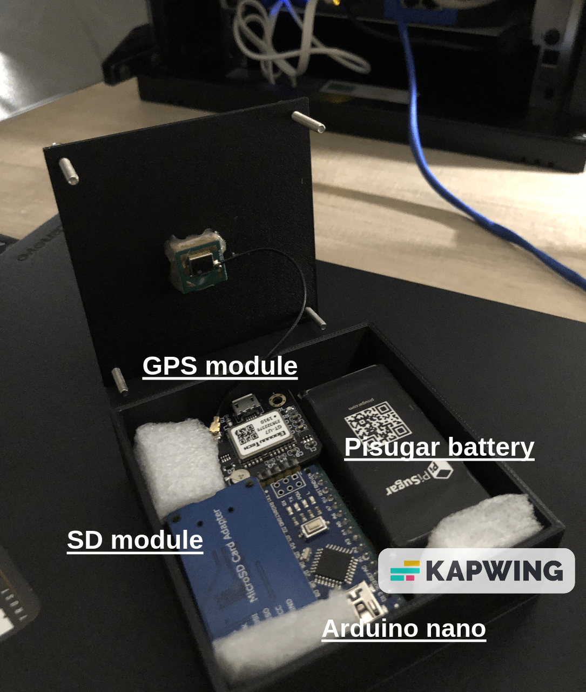

# Gps-Tracking
Questo progetto nasce con l'intento di creare un piccolo gps tracking senza affidarsi a servizi di terze parti.

 

# Come e' fatto
Il Gps-tracking e' composto da un'unita' di controllo (Arduino nano), la quale e' collegata a un modulo SD che memorizza la posizione rilevata (ogni 3 secondi) tramite il modulo GPS, il tutto alimentato da una batteria PiSugar con autonomia tra le 7/8 ore.

Lo schema non e' esattamente questo, ma vi basta leggere il file .ino per capire i corretti collegamenti.
