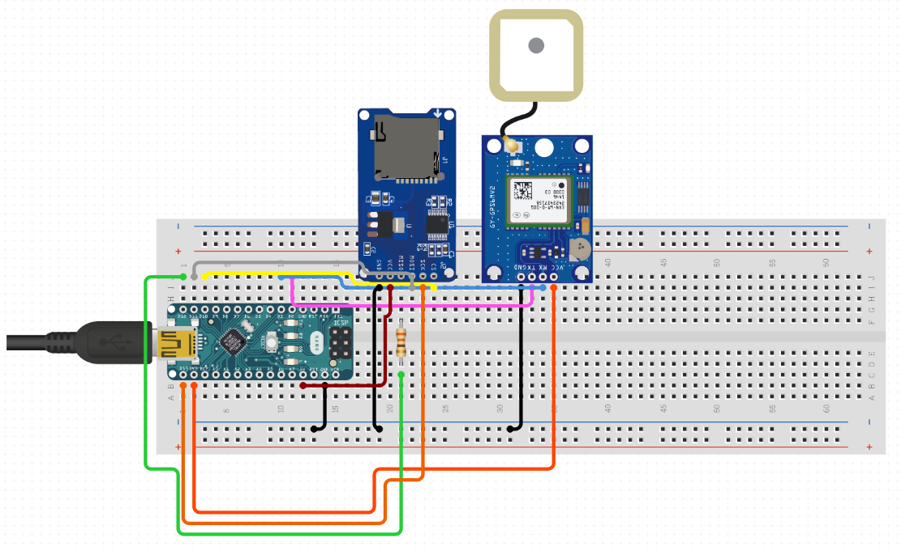

# Gps-Tracking

Questo progetto nasce con l'intento di creare un piccolo gps tracking senza affidarsi a servizi di terze parti. In questo repository troverai i seguenti file:
- [html2canvas](https://github.com/niklasvh/html2canvas) - Turns DOM into Canvas.
- [Gps_SD.ino], contenente lo script che legge la posizione tramite il module GPS e scrive sul modulo SD.
- [inf.sl], contenente il modello 3d della parte superiore della custodia.
- [sup.sl], contenente il modello 3d della parte inferiore della custodia.
Se hai intenzione di stampare la custodia in  3d, sappi che ho utilizzato viti da 3mm per chiudere il sistema.
# Come e' fatto
Il Gps-tracking e' composto da un'unita' di controllo (Arduino nano), la quale e' collegata a un modulo SD che memorizza la posizione rilevata (ogni 3 secondi) tramite il modulo GPS. 

