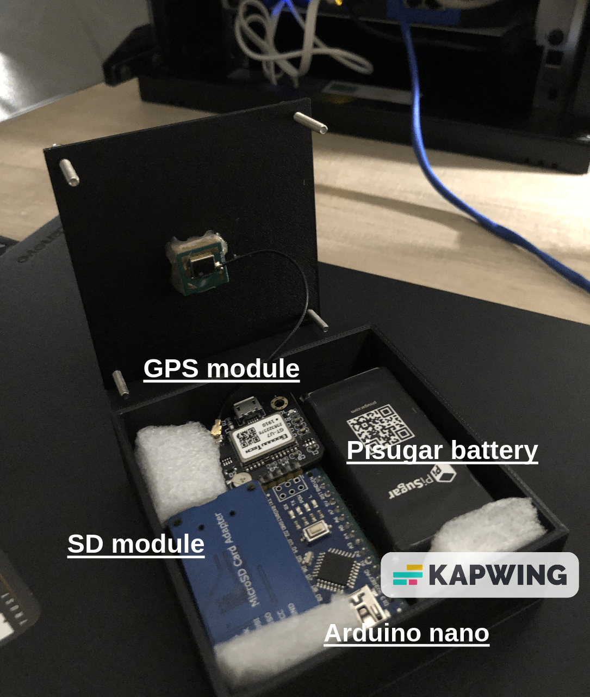
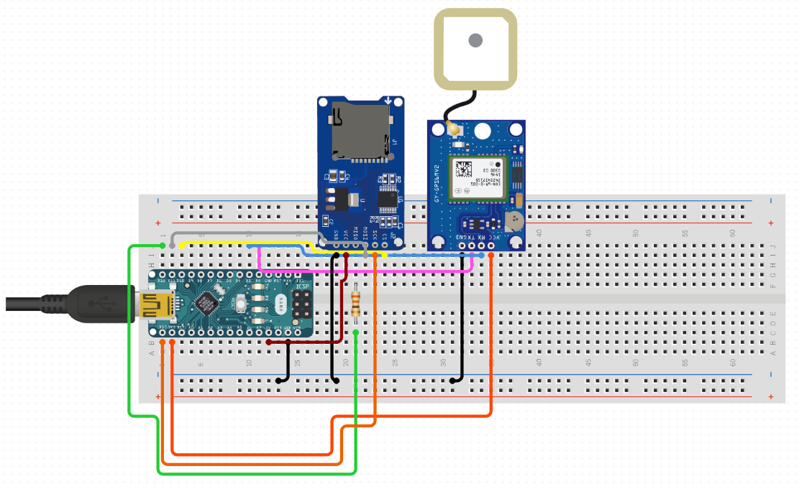

# Gps-Tracking
This project was born with the intention of creating a small gps tracking without relying on third-party services.

 

## For the creation of this project you will need:
- [Arduino nano](https://www.amazon.it/Elegoo-Scheda-Microcontrollore-ATmega328P-Arduino/dp/B0716S43Q2/ref=sr_1_5?__mk_it_IT=%C3%85M%C3%85%C5%BD%C3%95%C3%91&crid=AFNHZKCG2AVI&keywords=arduino+nano&qid=1677882252&sprefix=arduino+nano%2Caps%2C461&sr=8-5)
- [SD module](https://www.amazon.it/AZDelivery-Reader-Memory-Shield-Arduino/dp/B06X1DX5WS/ref=sr_1_5?keywords=arduino+sd+card+module&qid=1677771051&sprefix=sd+module+a%2Caps%2C164&sr=8-5)
- [M6 gps module](https://www.amazon.it/Aideepen-GY-GPS6MV2-Posizione-Antenna-Controller/dp/B08CZSL193/ref=sr_1_6?__mk_it_IT=%C3%85M%C3%85%C5%BD%C3%95%C3%91&crid=1RTDJSP7UCFB8&keywords=gps+arduino&qid=1677771070&sprefix=gps+arduino%2Caps%2C163&sr=8-6)
- >= 1200mAh Battery

## How it works
Gps-tracking is composed of a control unit (Arduino nano), which is connected to an SD module that stores the position detected (every 3 seconds) by the GPS module, all powered by a PiSugar battery with an autonomy of 7 to 8 hours.
In order to be able to view the 2d map of the networks found, you should use this site: [Map](https://www.gpsvisualizer.com/)

## Assembly
The diagram is not exactly this, but you only need to read the .ino file to understand the correct connections.

## Disclaimer
I recommend using this device for testing, learning and fun :D
